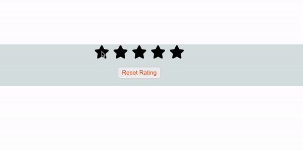

# Star-Rating-Project

Star Rating Project

install react icons dependency to get star icons
npm i react-icons

in App.js we pass number of stars as a prop

import "./App.css";
import StarRating from "./components";

function App() {
  return (
    

      <StarRating noOfStars={5}/>
    

  );
}

export default App;

in index.jsx

export default function StarRating({ noOfStars }) {
  const [rating, setRating] = useState(0);
  const [hover, setHover] = useState(0);

State Variables:
rating: Tracks the current rating selected by the user.
hover: Tracks the star being hovered over by the user.

Event Handlers
  function handleClick(getCurrentIndex) {
    setRating(getCurrentIndex);
  }

  function handleMouseEnter(getCurrentIndex) {
    setHover(getCurrentIndex);
  }

  function handleMouseLeave() {
    setHover(rating);
  }

  function handleReset() {
    setRating(0);
    setHover(0);
  }

-handleClick: Sets the rating state to the index of the star that was clicked.
-handleMouseEnter: Sets the hover state to the index of the star that is being hovered over.
-handleMouseLeave: Resets the hover state to the current rating, effectively showing the rating when the mouse is not hovering over the stars.
-handleReset: Resets both the rating and hover states to 0.

  return (
    

      

        {[...Array(noOfStars)].map((_, index) => {
          index += 1;
          return (
            <FaStar
              key={index}
              className={index <= (hover || rating) ? "active" : "inactive"}
              onClick={() => handleClick(index)}
              onMouseEnter={() => handleMouseEnter(index)}
              onMouseLeave={() => handleMouseLeave()}
              size={40}
            />
          );
        })}
      

      <button className={"resetBtn"} onClick={handleReset}>
        Reset Rating
      </button>
    

  );
}

: A div to contain the star icons.
[...Array(noOfStars)].map((_, index) => { ... }): Creates an array with noOfStars elements and maps over it to render the stars.
index += 1;: Increments the index by 1 to start star counting from 1 instead of 0.
<FaStar ... />: Renders a star icon for each index.
key={index}: Unique key for each star.
className={index <= (hover || rating) ? "active" : "inactive"}: Applies the active class if the star is less than or equal to the hover or rating value, otherwise applies the inactive class.
onClick={() => handleClick(index)}: Calls handleClick with the star index when a star is clicked.
onMouseEnter={() => handleMouseEnter(index)}: Calls handleMouseEnter with the star index when a star is hovered over.
onMouseLeave={() => handleMouseLeave()}: Calls handleMouseLeave when the mouse leaves a star.
size={40}: Sets the size of the star icon.
<button className={"resetBtn"} onClick={handleReset}>: A button that calls handleReset to reset the rating when clicked.

in CSS
.active: Sets the color for active stars.
.inactive: Sets the color for inactive stars.

